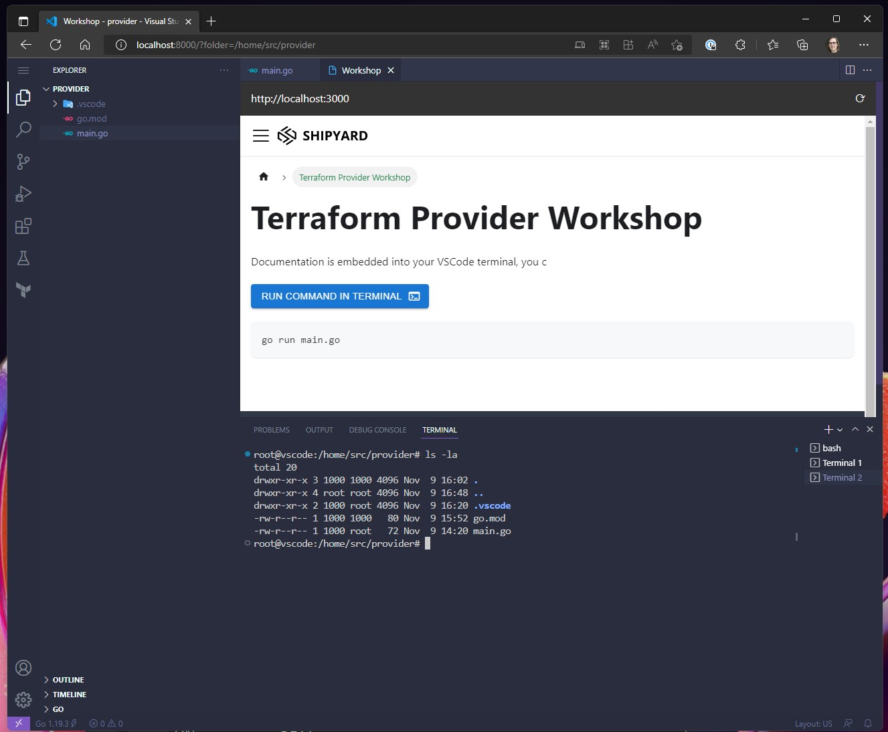
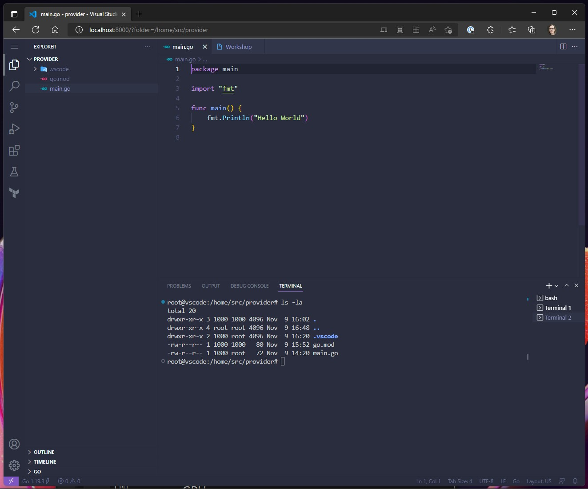

# How to Build a HashiCorp Terraform Provider

This repository contains a walk through explaining the steps required for building a HashiCorp Terraform Provider. 
You will learn how to create a custom provider using a RESTful API that has the capability of terraforming a Minecraft
world.

To follow the steps in this workshop you will need the following tools installed and configured:

### Required:
* Jumppad [https://jumppad.dev/docs/introduction/installation](https://jumppad.dev/docs/introduction/installation)
* Docker [https://docs.docker.com/get-docker/](https://docs.docker.com/get-docker/)

### Optional:
* Terraform (if not using Docker based environment)
* Go (if not using Docker based environment)
* A Go development environment like VSCode (if not using Docker based environment)
* Minecraft client

## Using the Docker based Workshop Environment
The Docker based workshop environment provides a browser based Visual Studio Code setup
that has Go, Terraform, the other tools required for the workshop installed an pre-configured.

First clone this repository, you will need all the files locally.

```
git clone https://github.com/nicholasjackson/terraform-provider-workshop.git
```

Next, you will need to install Docker and Jumppad, Docker can be downloaded from
[https://docs.docker.com/get-docker/](https://docs.docker.com/get-docker/) or 
installed using a package manager.

Jumpoad is a small binary application that automates the creation of Docker containers, it is like 
a cross between Docker Compose and Terraform. To run the environment you will need to have Shipyard
installed. You can find installations for most environments on the install page:

[https://jumppad.dev/docs/introduction/installation](https://jumppad.dev/docs/introduction/installation)

Or if you prefer you can download the latest binary from Github releases:

[https://github.com/jumppad-labs/jumppad/releases/tag/0.7.0](https://github.com/jumppad-labs/jumppad/releases/tag/0.7.0)

Once Jumppad is installed and Docker is running, you can use the following command to start the environment.

```shell
jumppad up ./jumppad
```

Jumppad will pull the required Docker containers from Docker Hub, the environment is approximately 2GB and may
take a short while to initialize.

```shell
Running configuration from:  ./jumppad

2022-11-09T16:48:46.808Z [INFO]  Creating resources from configuration: path=/home/nicj/go/src/github.com/nicholasjackson/terraform-provider-workshop/shipyard
2022-11-09T16:48:46.810Z [INFO]  Creating Network: ref=local
2022-11-09T16:48:46.919Z [INFO]  Creating Documentation: ref=docs
2022-11-09T16:48:46.919Z [INFO]  Creating Container: ref=vscode
2022-11-09T16:48:46.919Z [INFO]  Creating ImageCache: ref=docker-cache
2022-11-09T16:48:46.920Z [INFO]  Creating Container: ref=minecraft_web
2022-11-09T16:48:46.919Z [INFO]  Creating Container: ref=minecraft
```

If you run a `jumppad status` you will see the following:

```
➜ jumppad status
✔  module.workshop.resource.chapter.data_sources
✔  module.workshop.resource.chapter.testing
✔  module.workshop.resource.chapter.provider
✔  module.workshop.resource.chapter.introduction
✔  module.workshop.resource.chapter.resources
✔  resource.network.main
✔  resource.copy.server_files
✔  resource.copy.source_files
✔  resource.container.minecraft_web
    └─ minecraft-web.container.jumppad.dev
✔  resource.container.minecraft
    └─ minecraft.container.jumppad.dev
✔  resource.container.vscode
    └─ vscode.container.jumppad.dev
✔  resource.docs.docs
✔  resource.image_cache.default
✔  resource.template.vscode_settings
✔  resource.template.vscode_jumppad
✔  module.workshop.resource.book.terraform_provider

Pending: 0  Created: 16  Failed: 0  Disabled: 0
```

And since Jumppad just wraps Docker you can see the containers running with `docker ps` 

```
➜ docker ps
CONTAINER ID   IMAGE                                     COMMAND                  CREATED         STATUS         PORTS                                                                        NAMES
5ec683bc8ed0   shipyardrun/docker-registry-proxy:0.6.3   "/entrypoint.sh"         3 minutes ago   Up 3 minutes   80/tcp, 8081-8082/tcp, 0.0.0.0:33125->3128/tcp                               docker-cache.image-cache.shipyard.run
e25dc3301aa7   hashicraft/minecraft:v1.18.2-fabric       "/minecraft/entrypoi…"   3 minutes ago   Up 3 minutes   0.0.0.0:9090->9090/tcp, 0.0.0.0:25565->25565/tcp, 0.0.0.0:27015->27015/tcp   minecraft.container.shipyard.run
28c30d3ad343   hashicraft/minecraft-web:0.4.0            "node server.js"         3 minutes ago   Up 3 minutes   0.0.0.0:8080->8080/tcp                                                       minecraft-web.container.shipyard.run
d433e7f2133f   shipyardrun/docs:v0.6.1                   "./entrypoint.sh"        3 minutes ago   Up 3 minutes   35729/tcp, 0.0.0.0:37950->37950/tcp, 0.0.0.0:3000->80/tcp                    docs.docs.shipyard.run
2774eef1c60b   nicholasjackson/vscodeserver:tfw          "code-server serve-l…"   3 minutes ago   Up 3 minutes   0.0.0.0:8000->8000/tcp
```

### Using the Environment

To use the workshop environment, open the following link in your browser:

[http://localhost:8000/?folder=/provider](http://localhost:8000/?folder=/provider)

You will see the in built documentation



and also you will see the example Go application



There is also an interactive terminal, all the software you need for the environment is installed for you.
Files in the folder `/home/src/provider` are persisted to `provider` folder in this repository. All other changes
you make in the browser based environment will be discarded when it terminates. 


## Stopping the Workshop Environment

To stop the environment you can use the following command:

```shell
jumppad destroy
```

The conainers used by the environment will be disposed.

```
2022-11-09T16:58:33.310Z [INFO]  Destroy ImageCache: ref=docker-cache
2022-11-09T16:58:33.310Z [INFO]  Destroy Container: ref=vscode
2022-11-09T16:58:33.310Z [INFO]  Destroy Documentation: ref=docs
2022-11-09T16:58:33.310Z [INFO]  Destroy Container: ref=minecraft
2022-11-09T16:58:33.310Z [INFO]  Destroy Container: ref=minecraft_web
2022-11-09T16:59:04.355Z [INFO]  Destroy Network: ref=local
```

## Removing the Workshop Environment

To clean up and remove any resources downloaded by the environment you can use the following command:

```
jumppad purge
```

This command removes any Docker images that the workshop uses, only run this command once you are
completely done with the workshop or you will have to pull all the Docker containers again
next time you run `jumppad run`.

```
2022-11-09T17:01:00.601Z [INFO]  Removing image: image=docker.io/library/alpine:latest
2022-11-09T17:01:00.617Z [INFO]  Removing image: image=docker.io/shipyardrun/docker-registry-proxy:0.6.3
2022-11-09T17:01:10.134Z [INFO]  Removing image: image=docker.io/shipyardrun/k3s:v1.23.12
2022-11-09T17:01:17.450Z [INFO]  Removing image: image=docker.io/hashicraft/minecraft-web:0.4.0
2022-11-09T17:01:18.552Z [INFO]  Removing image: image=docker.io/hashicraft/minecraft:v1.18.2-fabric
2022-11-09T17:01:18.961Z [INFO]  Removing image: image=docker.io/nicholasjackson/vscodeserver:tfw
2022-11-09T17:01:21.109Z [INFO]  Removing image: image=docker.io/shipyardrun/docs:v0.6.1
2022-11-09T17:01:25.384Z [INFO]  Removing Docker image cache
2022-11-09T17:01:25.483Z [INFO]  Removing cached blueprints: path=/home/nicj/.shipyard/blueprints
2022-11-09T17:01:25.547Z [INFO]  Removing cached Helm charts: path=/home/nicj/.shipyard/helm_charts
2022-11-09T17:01:25.573Z [INFO]  Removing cached releases: path=/home/nicj/.shipyard/releases
2022-11-09T17:01:25.574Z [INFO]  Removing data folders: path=/home/nicj/.shipyard/data
2022-11-09T17:01:25.574Z [INFO]  Removing config: path=/home/nicj/.shipyard/config
```
